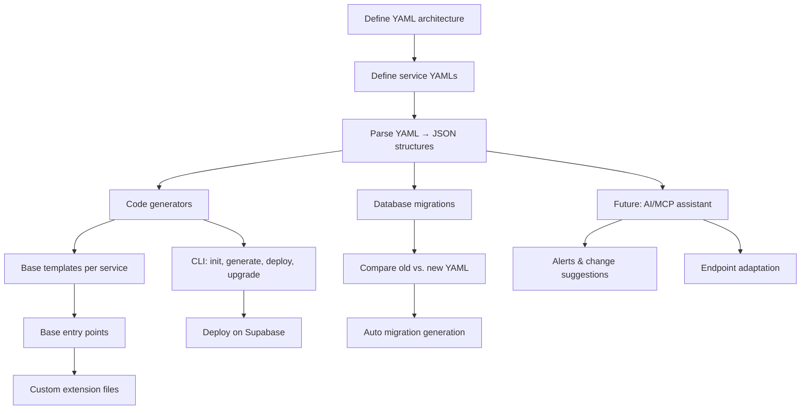

# Brickend MVP

Brickend is a **CLI tool** that turns a simple YAML definition into a fully functional backend powered by **Supabase**.  
It helps you define your project architecture, services, database tables, authentication, and APIs — all from configuration files — and generates ready-to-use code with clear extension points for customization.

Think of Brickend as your **backend blueprint**: you describe your system once in YAML, and Brickend handles the code scaffolding, migrations, and contracts for you.

---

## ✨ Features

- **CLI driven workflow**  
  Manage your backend with simple commands:
  - `brickend init` → create a new project with Supabase configuration and framework utilities.  
  - `brickend generate` → generate services, methods, contracts, and database migrations from YAML.  
  - `brickend deploy` → deploy functions, run migrations, and configure Supabase.  
  - `brickend upgrade` → upgrade framework code while preserving your business logic.  

- **YAML-first configuration**  
  - `brickend.yaml` → global project architecture, env variables, and list of services.  
  - `service.yaml` → per-service configuration (tables, methods, relations).  

- **Supabase integration**  
  - Database schema & migrations.  
  - Authentication (user or service key).  
  - Deno functions as endpoints.  
  - Supabase CLI orchestration.  

- **Configurable services**  
  Each service can define:  
  - Authentication requirements (service or user-based).  
  - Query parameters for filtering, pagination, and sorting.
  - Path parameters for resource identification.
  - Custom headers for authentication and metadata.
  - Rate limits and CORS policies.  

- **Contracts & interfaces**  
  Automatically generated Zod schemas and TypeScript interfaces for tables, queries, and endpoints — providing both runtime validation and compile-time type safety from a single source of truth.  

- **Safe customization**  
  Each service includes:  
  - A **base router** (framework code, do not modify) that handles HTTP routing, validation, auth, and rate limiting.  
  - **Individual method files** (generated once, safe to modify) where you add custom business logic.
  - **Framework utilities** (`_shared/`, do not modify) for consistent error handling, auth, and responses.
  - **Service-specific utils** (optional, safe to modify) for organizing method-specific helpers.  

- **Automatic migrations**  
  Compare old vs new YAMLs → generate DB migrations without manual SQL.  

---

## ⚙️ Requirements

- [Bun](https://bun.sh) – package manager & runtime  
- [Zod](https://zod.dev) – schema validation  
- [Supabase CLI](https://supabase.com/docs/guides/cli) – deploy, DB, and functions  

---

## 🚀 Quickstart

```bash
# Install Brickend globally
bun install -g brickend

# 1. Initialize a new project (creates Supabase + Brickend structure)
brickend init my-project
# → Creates project structure + _shared/ framework utilities + supabase config

# 2. Generate services from YAML definitions  
brickend generate
# → Creates service routers + method files + contracts + migrations

# 3. Deploy to Supabase
brickend deploy
# → Deploys functions, runs migrations, applies settings

# 4. Upgrade to latest Brickend version
brickend upgrade
```

---

## 📂 Project structure

```bash
my-project/
│
├─ brickend.yaml         # global project definition
│
├─ services/
│   ├─ users.yaml        # users service definition (tables, methods, relations)
│   └─ invoices.yaml     # invoices service definition (tables, methods, relations)
├─ .env                  # environment variables (not committed)
├─ .env.example          # environment template
├─ .gitignore            # git ignore rules
│
├─ supabase/             # Supabase project files
│   ├─ config.toml       # Supabase configuration
│   ├─ seed.sql          # database seed data
│   ├─ migrations/       # database migrations
│   │   ├─ 001_initial_tables.sql
│   │   ├─ 002_add_invoices.sql
│   │   └─ 003_add_users.sql
│   └─ functions/        # generated Supabase Edge functions
│       ├─ _shared/      # framework utilities (do not modify)
│       │   ├─ errors.ts # error response builders
│       │   ├─ responses.ts # standard response formatters
│       │   ├─ auth.ts   # authentication & permission validation
│       │   ├─ validation.ts # parameter parsing helpers
│       │   └─ database.ts # query building helpers
│       ├─ users/
│       │   ├─ index.ts  # router with HTTP concerns (do not modify)
│       │   ├─ create.ts # createUser business logic (safe to modify)
│       │   ├─ get.ts    # getUser business logic (safe to modify)
│       │   ├─ list.ts   # listUsers business logic (safe to modify)
│       │   ├─ update.ts # updateUser business logic (safe to modify)
│       │   ├─ delete.ts # deleteUser business logic (safe to modify)
│       │   └─ utils/    # service-specific utilities (optional, safe to modify)
│       └─ invoices/
│           ├─ index.ts  # router with HTTP concerns (do not modify)
│           ├─ create.ts # createInvoice business logic (safe to modify)
│           ├─ get.ts    # getInvoice business logic (safe to modify)
│           ├─ list.ts   # listInvoices business logic (safe to modify)
│           ├─ update.ts # updateInvoice business logic (safe to modify)
│           ├─ delete.ts # deleteInvoice business logic (safe to modify)
│           └─ utils/    # service-specific utilities (optional, safe to modify)
│
└─ contracts/            # generated contracts (organized by service)
    ├─ users/
    │   ├─ schemas.ts    # Zod schemas for users service
    │   └─ types.ts      # TypeScript interfaces for users service
    ├─ invoices/
    │   ├─ schemas.ts    # Zod schemas for invoices service
    │   └─ types.ts      # TypeScript interfaces for invoices service
    └─ index.ts          # exports all contracts
```

---

## 📝 Example: `brickend.yaml`

```yaml
project:
  name: my-saas
  env:
    SUPABASE_URL: ${SUPABASE_URL}
    SUPABASE_SERVICE_KEY: ${SUPABASE_SERVICE_KEY}

services:
  - name: users
    path: ./services/users.yaml
  - name: invoices
    path: ./services/invoices.yaml
```

## 📝 Example: `supabase/config.toml`

```toml
# Generated by `brickend init` - Supabase project configuration

[api]
enabled = true
port = 54321
schemas = ["public", "graphql_public"]
extra_search_path = ["public", "extensions"]
max_rows = 1000

[auth]
enabled = true
port = 54324
site_url = "http://localhost:3000"
additional_redirect_urls = ["https://localhost:3000"]
jwt_expiry = 3600
external_email_enabled = true
external_phone_enabled = true

[db]
port = 54322
major_version = 15

[functions]
enabled = true
port = 54321

[storage]
enabled = true
port = 54325
file_size_limit = 52428800

[edge_runtime]
enabled = true
ip_version = "ipv4"
```

---

## 📝 Example: `services/invoices.yaml`

```yaml
service:
  name: invoices
  auth:
    required: true
    mode: user   # user | service
  pagination: true
  rateLimit: 1000
  cors: "*"

tables:
  - name: invoices
    fields:
      - name: id
        type: uuid
        primary: true
      - name: customer_id
        type: uuid
        references: users.id
      - name: total
        type: int
      - name: created_at
        type: timestamp default now()

methods:
  - name: createInvoice
    type: post
    input:
      - customer_id: uuid
      - total: int
    output:
      - id: uuid
      - total: int
      - created_at: timestamp
    headers:
      - authorization: string required
      - x-request-id: string optional
  
  - name: getInvoice
    type: get
    path_params:
      - id: uuid
    output:
      - id: uuid
      - customer_id: uuid
      - total: int
      - created_at: timestamp
    headers:
      - authorization: string required
  
  - name: listInvoices
    type: get
    query_params:
      - page: int optional default(1)
      - limit: int optional default(10)
      - status: string optional enum(draft,sent,paid,overdue)
      - customer_id: uuid optional
      - date_from: date optional
      - date_to: date optional
      - sort_by: string optional enum(created_at,total,due_date) default(created_at)
      - order: string optional enum(asc,desc) default(desc)
    output:
      - data: array[invoice]
      - pagination:
          page: int
          limit: int
          total: int
          pages: int
          has_next: boolean
          has_prev: boolean
    headers:
      - authorization: string required
  
  - name: updateInvoice
    type: put
    path_params:
      - id: uuid
    input:
      - total: int
      - status: string optional
    output:
      - id: uuid
      - total: int
      - status: string
      - updated_at: timestamp
    headers:
      - authorization: string required
  
  - name: deleteInvoice
    type: delete
    path_params:
      - id: uuid
    output:
      - success: boolean
    headers:
      - authorization: string required

# Custom method names supported
  - name: sendInvoiceReminder
    type: post
    path_params:
      - id: uuid
    input:
      - message: string optional
    output:
      - sent: boolean
      - sent_at: timestamp
    headers:
      - authorization: string required
```

---

## 🔧 Parameter Types

Brickend supports various parameter types for flexible API design:

### **Query Parameters** (`query_params`)
- Used for filtering, pagination, sorting, and search
- Automatically parsed from URL query string
- Support: `optional`, `default()`, `enum()`, validation constraints

### **Path Parameters** (`path_params`)  
- Used for resource identifiers in REST URLs
- Extracted from URL path segments (e.g., `/invoices/:id`)
- Typically required and strongly typed

### **Headers** (`headers`)
- Used for authentication, metadata, and request context
- Support: `required`, `optional`
- Common patterns: authorization, content-type, x-api-key

### **Body Input** (`input`)
- Used for POST/PUT request data
- Validated against Zod schemas
- Supports complex nested objects and arrays

### **Supported Types & Constraints**
```yaml
# Basic types
- name: string
- age: int
- price: float
- active: boolean
- id: uuid
- created_at: timestamp
- birth_date: date

# With constraints  
- status: string enum(draft,active,archived)
- page: int optional default(1)
- limit: int optional min(1) max(100)
- email: string optional format(email)
```

---

## 📋 Standards & Conventions

### **🚨 Error Handling**

Brickend generates consistent error handling across all endpoints:

```ts
// Standard error response format
interface ErrorResponse {
  error: {
    code: string;           // Error code (e.g., "VALIDATION_ERROR")
    message: string;        // Human-readable message
    details?: any;          // Additional error context
    timestamp: string;      // ISO timestamp
    request_id?: string;    // For tracking/debugging
  }
}

// HTTP Status Codes
200 - Success
201 - Created
400 - Bad Request (validation errors)
401 - Unauthorized (missing/invalid auth)
403 - Forbidden (insufficient permissions)
404 - Not Found
409 - Conflict (duplicate resources)
422 - Unprocessable Entity (business logic errors)
429 - Too Many Requests (rate limiting)
500 - Internal Server Error
```

**Generated error handling example:**
```ts
export async function createInvoice(req: Request): Promise<CreateInvoiceOutput> {
  try {
    const input = CreateInvoiceInputSchema.parse(await req.json());
    const headers = CreateInvoiceHeadersSchema.parse({
      authorization: req.headers.get('authorization')
    });
    
    return await createInvoiceExtension(input, headers);
  } catch (error) {
    if (error instanceof z.ZodError) {
      return new Response(JSON.stringify({
        error: {
          code: "VALIDATION_ERROR",
          message: "Invalid input data",
          details: error.errors,
          timestamp: new Date().toISOString()
        }
      }), { status: 400 });
    }
    
    // Handle other errors...
    return new Response(JSON.stringify({
      error: {
        code: "INTERNAL_ERROR",
        message: "An unexpected error occurred",
        timestamp: new Date().toISOString()
      }
    }), { status: 500 });
  }
}
```

### **🔍 Filtering & Query Patterns**

Brickend supports rich filtering capabilities:

```yaml
# Advanced filtering example
query_params:
  # Pagination
  - page: int optional default(1)
  - limit: int optional default(10) min(1) max(100)
  
  # Basic filters
  - status: string optional enum(draft,sent,paid,overdue)
  - customer_id: uuid optional
  
  # Date range filtering
  - created_after: date optional
  - created_before: date optional
  - updated_since: timestamp optional
  
  # Numeric filters
  - total_min: int optional min(0)
  - total_max: int optional
  - amount_gte: float optional  # greater than or equal
  - amount_lte: float optional  # less than or equal
  
  # Text search
  - search: string optional     # full-text search
  - customer_name: string optional contains
  
  # Array filters
  - tags: array[string] optional
  - categories: array[uuid] optional
  
  # Sorting
  - sort_by: string optional enum(created_at,total,customer_name,due_date)
  - order: string optional enum(asc,desc) default(desc)
  
  # Field selection
  - fields: array[string] optional  # select specific fields
  - include: array[string] optional # include relations
```

### **📊 Data Structure Conventions**

Brickend follows consistent data patterns:

```ts
// Standard list response
interface ListResponse<T> {
  data: T[];              // Array of items
  pagination: {
    page: number;         // Current page
    limit: number;        // Items per page
    total: number;        // Total items count
    pages: number;        // Total pages
    has_next: boolean;    // Has next page
    has_prev: boolean;    // Has previous page
  };
  filters?: any;          // Applied filters
  sort?: {
    field: string;
    order: 'asc' | 'desc';
  };
}

// Standard timestamps
interface BaseEntity {
  id: string;             // UUID primary key
  created_at: string;     // ISO timestamp
  updated_at: string;     // ISO timestamp
  created_by?: string;    // User who created
  updated_by?: string;    // User who last updated
}

// Standard soft delete (optional)
interface SoftDeleteEntity extends BaseEntity {
  deleted_at?: string;    // ISO timestamp or null
  deleted_by?: string;    // User who deleted
}
```

### **📁 File Organization**

Services use a **router + individual method files** pattern with framework utilities:

```bash
supabase/functions/
├─ _shared/                    # Framework utilities (do not modify)
│  ├─ errors.ts               # Standard error handlers
│  ├─ responses.ts            # Response formatters  
│  ├─ auth.ts                 # Authentication & permission validation
│  ├─ validation.ts           # Parameter parsing helpers
│  └─ database.ts             # Query building utilities
└─ invoices/                  # Created by `brickend generate`
   ├─ index.ts                # HTTP router (framework code, do not modify)
   ├─ create.ts               # Business logic only (generated once, safe to modify)
   ├─ get.ts                  # Business logic only (generated once, safe to modify)
   ├─ list.ts                 # Business logic only (generated once, safe to modify)
   ├─ update.ts               # Business logic only (generated once, safe to modify)
   ├─ delete.ts               # Business logic only (generated once, safe to modify)
   └─ utils/                  # Service-specific helpers (optional, safe to modify)
      ├─ validation.ts        # Invoice-specific validation
      └─ transforms.ts        # Data transformations
```

**Modification Guidelines:**
- **`_shared/`** - Framework code, do not modify (breaks Brickend compatibility)
- **`index.ts`** - Framework code, do not modify (regenerated on changes)  
- **Method files** - Generated once, safe to modify (your business logic)
- **`utils/`** - Optional service-specific helpers, safe to modify

**Regeneration Strategy:**
- **Framework files** (`_shared/`, `index.ts`, contracts) - Regenerated to add features
- **Method files** - Generated once, never touched again by Brickend
- **Missing methods** - Only new method files are created for new methods in service.yaml
- **Contract changes** - Warning generated to check existing methods manually

**Warning System Example:**
```bash
$ brickend generate

⚠️  Contract Changes Detected:
   
   invoices/createInvoice:
   - Input field 'total' type changed: int → float
   - New required field 'currency' added
   
   invoices/listInvoices:  
   - Query param 'status' enum values changed
   
📝 Please review and update these method files manually:
   - supabase/functions/invoices/create.ts
   - supabase/functions/invoices/list.ts
   
✅ Generated:
   - supabase/functions/invoices/index.ts (updated router)
   - supabase/functions/invoices/send-invoice-reminder.ts (new method)
   - contracts/invoices/schemas.ts (updated contracts)
```

**Framework utilities example (`_shared/responses.ts`):**
```ts
// Framework code - do not modify (breaks Brickend compatibility)
export function createSuccessResponse(data: any, status = 200) {
  return new Response(JSON.stringify(data), {
    status,
    headers: { 'Content-Type': 'application/json' }
  });
}

export function createListResponse<T>(data: T[], pagination: any) {
  return createSuccessResponse({ data, pagination });
}

export function createErrorResponse(code: string, message: string, status = 400, details?: any) {
  return new Response(JSON.stringify({
    error: { 
      code, 
      message, 
      details,
      timestamp: new Date().toISOString(),
      request_id: crypto.randomUUID()
    }
  }), { 
    status, 
    headers: { 'Content-Type': 'application/json' } 
  });
}
```

---

## ⚡ Generated function examples

**`supabase/functions/invoices/index.ts`** (router with framework concerns – regenerated on changes):

```ts
import { createClient } from '@supabase/supabase-js';
import { createSuccessResponse, createErrorResponse } from '../_shared/responses';
import { validateAuth, applyRateLimit } from '../_shared/auth';
import { parseQueryParams, parsePathParams } from '../_shared/validation';
import { CreateInvoiceInputSchema, GetInvoicePathParamsSchema, ListInvoicesQueryParamsSchema, UpdateInvoiceInputSchema, DeleteInvoicePathParamsSchema } from '../../../contracts/invoices/schemas';

// Import method functions
import createInvoice from './create';
import getInvoice from './get';
import listInvoices from './list';
import updateInvoice from './update';
import deleteInvoice from './delete';
import sendInvoiceReminder from './send-invoice-reminder'; // Custom method

export default async function handler(req: Request) {
  try {
    // Initialize Supabase client ONCE
    const supabase = createClient(
      Deno.env.get('SUPABASE_URL') ?? '',
      Deno.env.get('SUPABASE_SERVICE_KEY') ?? ''
    );

    // Validate auth ONCE (configurable from service.yaml)
    const user = await validateAuth(req, { required: true, mode: 'user' });

    // Apply rate limiting (configurable from service.yaml)
    await applyRateLimit(req, { limit: 1000, window: '1h' });
    
    const url = new URL(req.url);
    const method = req.method;
    const pathSegments = url.pathname.split('/').filter(Boolean);
    
    switch (method) {
      case 'POST': {
        // Parse and validate input
        const input = CreateInvoiceInputSchema.parse(await req.json());
        
        // Call business logic
        const result = await createInvoice(input, user, supabase);
        return createSuccessResponse(result, 201);
      }
        
      case 'GET': {
        if (pathSegments.length > 2) {
          // GET /invoices/:id
          const pathParams = parsePathParams(url, GetInvoicePathParamsSchema);
          
          const result = await getInvoice(pathParams, user, supabase);
          return createSuccessResponse(result);
        } else {
          // GET /invoices (list with filtering)
          const queryParams = parseQueryParams(url, ListInvoicesQueryParamsSchema);
          
          const result = await listInvoices(queryParams, user, supabase);
          return createSuccessResponse(result);
        }
      }
        
      case 'PUT': {
        const pathParams = parsePathParams(url, GetInvoicePathParamsSchema);
        const input = UpdateInvoiceInputSchema.parse(await req.json());
        
        const result = await updateInvoice({ ...pathParams, ...input }, user, supabase);
        return createSuccessResponse(result);
      }
        
      case 'DELETE': {
        const pathParams = parsePathParams(url, DeleteInvoicePathParamsSchema);
        
        const result = await deleteInvoice(pathParams, user, supabase);
        return createSuccessResponse(result);
      }
      
      // Custom method: POST /invoices/:id/send-reminder
      case 'POST': {
        if (url.pathname.includes('/send-reminder')) {
          const pathParams = parsePathParams(url, GetInvoicePathParamsSchema);
          const input = SendInvoiceReminderInputSchema.parse(await req.json());
          
          const result = await sendInvoiceReminder({ ...pathParams, ...input }, user, supabase);
          return createSuccessResponse(result);
        }
        // ... regular createInvoice logic
      }
        
      default:
        return createErrorResponse('METHOD_NOT_ALLOWED', 'Method not allowed', 405);
    }
  } catch (error) {
    if (error.name === 'ZodError') {
      return createErrorResponse('VALIDATION_ERROR', 'Invalid input', 400, error.errors);
    }
    return createErrorResponse('INTERNAL_ERROR', error.message, 500);
  }
}
```

**`supabase/functions/invoices/create.ts`** (business logic only – generated once, safe to modify):

```ts
import { CreateInvoiceInput, CreateInvoiceOutput } from '../../../contracts/invoices/types';
import { CreateInvoiceInputSchema } from '../../../contracts/invoices/schemas';
import type { SupabaseClient } from '@supabase/supabase-js';

export default async function createInvoice(
  input: CreateInvoiceInput,
  user: { id: string; isAdmin?: boolean },
  supabase: SupabaseClient
): Promise<CreateInvoiceOutput> {
  
  // Additional input validation (optional)
  CreateInvoiceInputSchema.parse(input);
  
  // Add your custom business logic here
  // Example: validate customer exists, calculate taxes, etc.
  
  // Basic implementation - customize as needed
  const { data, error } = await supabase
    .from("invoices")
    .insert({
      ...input,
      status: 'draft',
      created_by: user.id,
      created_at: new Date().toISOString(),
      updated_at: new Date().toISOString(),
      // Add any computed fields
    })
    .select()
    .single();

  if (error) throw error;
  
  // Post-processing (send emails, webhooks, etc.)
  // await sendInvoiceCreatedEmail(data);
  
  return data;
}
```

**`supabase/functions/invoices/list.ts`** (business logic only – generated once, safe to modify):

```ts
import { ListInvoicesQueryParams, ListInvoicesOutput } from '../../../contracts/invoices/types';
import { ListInvoicesQueryParamsSchema } from '../../../contracts/invoices/schemas';
import type { SupabaseClient } from '@supabase/supabase-js';

export default async function listInvoices(
  queryParams: ListInvoicesQueryParams,
  user: { id: string; isAdmin?: boolean },
  supabase: SupabaseClient
): Promise<ListInvoicesOutput> {
  
  // Additional validation (optional)
  ListInvoicesQueryParamsSchema.parse(queryParams);
  
  let query = supabase
    .from("invoices")
    .select("*", { count: "exact" });
  
  // Apply user-specific filtering (row-level security)
  if (!user.isAdmin) {
    query = query.eq('customer_id', user.id);
  }
  
  // Apply dynamic filters - customize as needed
  if (queryParams.status) {
    query = query.eq('status', queryParams.status);
  }
  if (queryParams.customer_id) {
    query = query.eq('customer_id', queryParams.customer_id);
  }
  if (queryParams.date_from) {
    query = query.gte('created_at', queryParams.date_from);
  }
  if (queryParams.date_to) {
    query = query.lte('created_at', queryParams.date_to);
  }
  
  // Apply sorting
  query = query.order(queryParams.sort_by, { 
    ascending: queryParams.order === "asc" 
  });
  
  // Apply pagination
  const offset = (queryParams.page - 1) * queryParams.limit;
  query = query.range(offset, offset + queryParams.limit - 1);
  
  const { data, error, count } = await query;
  
  if (error) throw error;
  
  return {
    data: data || [],
    pagination: {
      page: queryParams.page,
      limit: queryParams.limit,
      total: count || 0,
      pages: Math.ceil((count || 0) / queryParams.limit),
      has_next: (count || 0) > queryParams.page * queryParams.limit,
      has_prev: queryParams.page > 1
    }
  };
}
```

**`supabase/functions/invoices/get.ts`** (business logic only – generated once, safe to modify):

```ts
import { GetInvoicePathParams, GetInvoiceOutput } from '../../../contracts/invoices/types';
import { GetInvoicePathParamsSchema } from '../../../contracts/invoices/schemas';
import type { SupabaseClient } from '@supabase/supabase-js';

export default async function getInvoice(
  pathParams: GetInvoicePathParams,
  user: { id: string; isAdmin?: boolean },
  supabase: SupabaseClient
): Promise<GetInvoiceOutput> {
  
  // Additional validation (optional)
  GetInvoicePathParamsSchema.parse(pathParams);
  
  // Add custom authorization logic
  const { data, error } = await supabase
    .from("invoices")
    .select("*")
    .eq("id", pathParams.id)
    .single();

  if (error) throw error;
  
  // Row-level security check
  if (!user.isAdmin && data.customer_id !== user.id) {
    throw new Error('Unauthorized access to invoice');
  }
  
  // Add computed fields, related data, etc.
  return {
    ...data,
    // computed_field: calculateSomething(data),
    // related_data: await fetchRelatedData(data.id)
  };
}
```

**`supabase/functions/invoices/send-invoice-reminder.ts`** (custom method – generated once, safe to modify):

```ts
import { SendInvoiceReminderInput, SendInvoiceReminderOutput } from '../../../contracts/invoices/types';
import { SendInvoiceReminderInputSchema } from '../../../contracts/invoices/schemas';
import type { SupabaseClient } from '@supabase/supabase-js';

export default async function sendInvoiceReminder(
  params: SendInvoiceReminderInput & { id: string },
  user: { id: string; isAdmin?: boolean },
  supabase: SupabaseClient
): Promise<SendInvoiceReminderOutput> {
  
  // Additional validation (optional)
  SendInvoiceReminderInputSchema.parse(params);
  
  // Get the invoice first
  const { data: invoice, error } = await supabase
    .from("invoices")
    .select("*")
    .eq("id", params.id)
    .single();

  if (error) throw error;
  
  // Authorization check
  if (!user.isAdmin && invoice.customer_id !== user.id) {
    throw new Error('Unauthorized access to invoice');
  }
  
  // Custom business logic - send reminder
  const reminderMessage = params.message || `Reminder: Invoice #${invoice.id} is due`;
  
  // Example: Send email, SMS, or notification
  // await sendEmailReminder(invoice.customer_email, reminderMessage);
  
  // Log the reminder
  const sent_at = new Date().toISOString();
  
  // Optional: Update invoice with reminder sent info
  await supabase
    .from("invoice_reminders")
    .insert({
      invoice_id: params.id,
      message: reminderMessage,
      sent_at,
      sent_by: user.id
    });
  
  return {
    sent: true,
    sent_at
  };
}
```

---

## 📜 Contracts

Brickend generates **organized contracts** with both Zod schemas and TypeScript interfaces for your DB tables and API methods, giving you runtime validation and compile-time type safety:

**Organized by service:**
```bash
contracts/
├─ users/
│  ├─ schemas.ts    # Zod schemas for users service
│  └─ types.ts      # TypeScript interfaces  
├─ invoices/
│  ├─ schemas.ts    # Zod schemas for invoices service
│  └─ types.ts      # TypeScript interfaces
└─ index.ts         # Re-exports everything
```

**`contracts/invoices/schemas.ts`** (Zod schemas):

```ts
import { z } from "zod";

// Table schema
export const InvoiceSchema = z.object({
  id: z.string().uuid(),
  customer_id: z.string().uuid(),
  total: z.number(),
  status: z.enum(["draft", "sent", "paid", "overdue"]),
  created_at: z.string(),
  updated_at: z.string(),
});

// Method input/output schemas
export const CreateInvoiceInputSchema = z.object({
  customer_id: z.string().uuid(),
  total: z.number(),
});

export const CreateInvoiceOutputSchema = InvoiceSchema;

export const GetInvoicePathParamsSchema = z.object({
  id: z.string().uuid(),
});

export const ListInvoicesQueryParamsSchema = z.object({
  page: z.number().int().min(1).default(1),
  limit: z.number().int().min(1).max(100).default(10),
  status: z.enum(["draft", "sent", "paid", "overdue"]).optional(),
  customer_id: z.string().uuid().optional(),
  date_from: z.string().date().optional(),
  date_to: z.string().date().optional(),
  sort_by: z.enum(["created_at", "total", "due_date"]).default("created_at"),
  order: z.enum(["asc", "desc"]).default("desc"),
});

export const ListInvoicesOutputSchema = z.object({
  data: z.array(InvoiceSchema),
  pagination: z.object({
    page: z.number().int(),
    limit: z.number().int(),
    total: z.number().int(),
    pages: z.number().int(),
    has_next: z.boolean(),
    has_prev: z.boolean(),
  }),
});

// Auth schemas
export const InvoiceHeadersSchema = z.object({
  authorization: z.string(),
});
```

**`contracts/invoices/types.ts`** (TypeScript interfaces):

```ts
import { z } from 'zod';
import { 
  InvoiceSchema, 
  CreateInvoiceInputSchema, 
  CreateInvoiceOutputSchema,
  GetInvoicePathParamsSchema,
  ListInvoicesQueryParamsSchema,
  ListInvoicesOutputSchema,
  InvoiceHeadersSchema
} from './schemas';

// Table types
export type Invoice = z.infer<typeof InvoiceSchema>;

// Method types
export type CreateInvoiceInput = z.infer<typeof CreateInvoiceInputSchema>;
export type CreateInvoiceOutput = z.infer<typeof CreateInvoiceOutputSchema>;

export type GetInvoicePathParams = z.infer<typeof GetInvoicePathParamsSchema>;
export type GetInvoiceOutput = Invoice;

export type ListInvoicesQueryParams = z.infer<typeof ListInvoicesQueryParamsSchema>;
export type ListInvoicesOutput = z.infer<typeof ListInvoicesOutputSchema>;

// Auth types
export type InvoiceHeaders = z.infer<typeof InvoiceHeadersSchema>;
```

**`contracts/index.ts`** (re-exports everything):

```ts
// Re-export all schemas and types
export * from './invoices/schemas';
export * from './invoices/types';
export * from './users/schemas';
export * from './users/types';

// Organized imports for specific services
export * as InvoiceSchemas from './invoices/schemas';
export * as InvoiceTypes from './invoices/types';
export * as UserSchemas from './users/schemas';
export * as UserTypes from './users/types';
```

This **single source of truth** ensures:
- **Runtime validation** with Zod schemas
- **Compile-time type safety** with TypeScript interfaces  
- **Consistent contracts** across backend and frontend
- **Automatic generation** from your service.yaml definitions

### **Client Usage Examples**

**Option 1: Import from main index (recommended)**
```ts
import { 
  ListInvoicesQueryParams, 
  CreateInvoiceInput,
  ListInvoicesQueryParamsSchema
} from "./contracts/index";

// GET /api/invoices with filtering
const queryParams: ListInvoicesQueryParams = {
  page: 1,
  limit: 20,
  status: "paid",
  customer_id: "123e4567-e89b-12d3-a456-426614174000",
  date_from: "2024-01-01",
  sort_by: "created_at",
  order: "desc"
};

// Validate on client side (optional)
const validatedParams = ListInvoicesQueryParamsSchema.parse(queryParams);

const response = await fetch(`/api/invoices?${new URLSearchParams(validatedParams)}`, {
  headers: {
    'Authorization': 'Bearer your-token',
    'Content-Type': 'application/json'
  }
});

const result = await response.json();
// result.data contains the invoices array
// result.pagination contains pagination metadata
```

**Option 2: Import by service (for larger projects)**
```ts
import { InvoiceTypes, InvoiceSchemas } from "./contracts/index";

// Type-safe with organized imports
const newInvoice: InvoiceTypes.CreateInvoiceInput = {
  customer_id: "123e4567-e89b-12d3-a456-426614174000",
  total: 1500
};

// Validate with schemas
const validatedInvoice = InvoiceSchemas.CreateInvoiceInputSchema.parse(newInvoice);

const createResponse = await fetch('/api/invoices', {
  method: 'POST',
  headers: {
    'Authorization': 'Bearer your-token',
    'Content-Type': 'application/json'
  },
  body: JSON.stringify(validatedInvoice)
});
```

---

## 🔄 Flow



---

## 🛠 Roadmap (MVP scope)

✅ Supabase DB, Auth, Functions, CLI  
✅ YAML → JSON parser  
✅ Code generators (services, tables, methods)  
✅ Contracts & interfaces with organized structure by service
✅ Router + individual method files pattern with shared utilities
✅ Advanced filtering and query parameters
✅ Modular file organization (`_shared` pattern)
✅ Error handling standards and response formatters
✅ Individual method files (generated once, never touched)
✅ Warning system for contract changes
✅ Support for custom method names

🔜 Future:  
- Deploy to Vercel / Trigger.dev  
- AI/MCP assistant for endpoint suggestions  
- Multi-environment support (dev/prod)  

---

## 💡 Additional Recommendations

### **🔐 Security & Auth**
```yaml
# Enhanced authentication options
service:
  auth:
    required: true
    mode: user                    # user | service | mixed
    permissions:                  # Role-based access control
      - role: admin
        actions: [create, read, update, delete]
      - role: user  
        actions: [read]
        filters: { customer_id: "${user.id}" }  # Row-level security
    rate_limit:
      requests_per_minute: 1000
      burst: 50
```

### **📊 Observability & Monitoring**
```yaml
# Built-in observability
service:
  monitoring:
    metrics: true               # Request count, latency, errors
    logging:
      level: info               # debug | info | warn | error
      include_request_body: false
      include_response_body: false
    tracing: true               # Distributed tracing
    alerts:
      error_rate_threshold: 5   # Alert if >5% error rate
      latency_threshold: 1000   # Alert if >1s p95 latency
```

### **🚀 Performance Optimizations**
```yaml
# Performance features
service:
  caching:
    enabled: true
    ttl: 300                   # Cache for 5 minutes
    keys: [customer_id, status] # Cache keys
  database:
    connection_pooling: true
    read_replicas: true        # Use read replicas for GET requests
  compression:
    enabled: true
    level: 6                   # gzip compression level
```

### **🔄 Advanced Patterns**
```yaml
# Event-driven features
service:
  events:                      # Emit events for other services
    - name: invoice.created
      payload: [id, customer_id, total]
    - name: invoice.updated  
      payload: [id, changes]
  
  webhooks:                    # External webhooks
    - url: https://api.stripe.com/webhooks
      events: [invoice.paid]
      auth: { type: bearer, token: "${STRIPE_WEBHOOK_SECRET}" }
  
  background_jobs:             # Async processing
    - name: send_invoice_email
      trigger: invoice.created
      retry: 3
```

### **🌍 Multi-Environment Support**
```yaml
# Environment-specific configs
environments:
  development:
    database: supabase_dev
    rate_limit: 10000
    logging_level: debug
  
  staging:
    database: supabase_staging  
    rate_limit: 5000
    logging_level: info
  
  production:
    database: supabase_prod
    rate_limit: 1000
    logging_level: warn
    monitoring: true
```

### **🤖 AI Integration**
```yaml
# AI-powered features (future)
service:
  ai:
    auto_optimize: true        # Auto-optimize queries
    suggest_indexes: true      # Suggest missing DB indexes
    anomaly_detection: true    # Detect unusual patterns
    auto_documentation: true   # Generate API docs
```

### **📦 Package Ecosystem**
- **`@brickend/react`** - React hooks for type-safe API calls
- **`@brickend/vue`** - Vue.js composables  
- **`@brickend/testing`** - Testing utilities
- **`@brickend/docs`** - Auto-generated API documentation
- **`@brickend/metrics`** - Performance monitoring dashboard

---

## 🤝 Contributing

Brickend is in **MVP stage**. Contributions, feedback, and suggestions are welcome.  
Fork the repo, open issues, and help us shape the future of backend generation.

---
